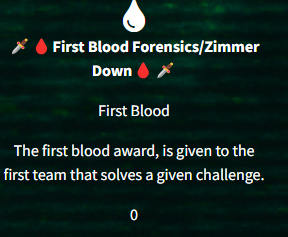

# Zimmer Down

## Description


```
A user interacted with a suspicious file on one of our hosts.
The only thing we managed to grab was the user's registry hive.
Are they hiding any secrets?

```

## Managed to get first blood on this chall 🩸



## How to solve the CTF and info:

First, let's read the description carefully and highlight some important keywords: "interacted" and "file".


When it comes to Registry forensics I always use [Registy Explorer](https://ericzimmerman.github.io/#!index.md)

Load the file the **Ntuser.dat** file in to registry explorer. 

When investigating recently interacted or accessed files, we focus on the subkey **RecentDocs**.


## What is the RecentDocs Key?

The RecentDocs registry key in the NTUSER.DAT file tracks recently accessed documents for a user. This key helps Windows quickly display recently opened files in applications like File Explorer. While it's handy for user experience and troubleshooting, we use it here strictly for forensic analysis. 😉

 The RecentDocs key is typically found in the following location within a user’s NTUSER.DAT hive:
```
Software\Microsoft\Windows\CurrentVersion\Explorer\RecentDocs
```

Under the RecentDocs subkey, there are additional subkeys grouped by file extensions, such as: ```.PNG```,```.JPEG```,```.DOC```


## Contunuing the CTF:

Now to put my skills to the test! I navigate to::

```
Software\Microsoft\Windows\CurrentVersion\Explorer\RecentDocs
```

I notice a subkey called **.b62**, which is an unfamiliar extension to me. However, it immediately reminds me of Base62 encoding. 

Under the **Target Name** field, I find the following file:

```
Target Name
VJGSuERgCoVhl6mJg1x87faFOPIqacI3Eby4oP5MyBYKQy5paDF.b62
```

I copy the file name and paste it into CyberChef, selecting the Base62 decoding option.

The flag should appear after decoding!


